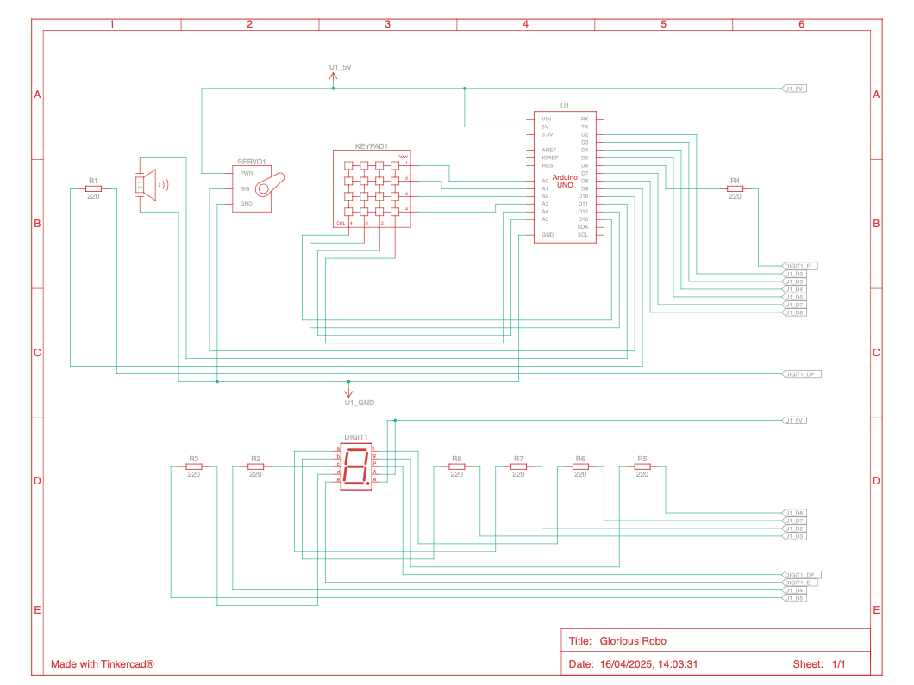
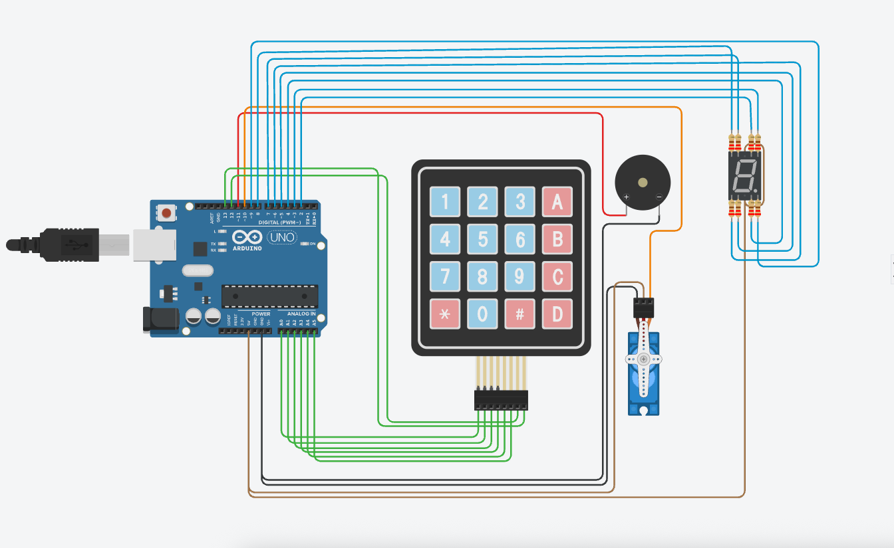

# DigiLock v1.0 🔐

A 6-digit keypad-based digital locking system built using **Arduino Uno**, featuring
servo-based locking, buzzer feedback, 7-segment display output, and MATLAB serial monitoring.

---

## 📌 Project Overview

DigiLock v1.0 is a password-protected digital lock system designed to demonstrate
core embedded system concepts such as keypad interfacing, display control,
actuator control, and serial communication.

The system validates a 6-character password entered via a keypad.
Correct input unlocks the system using a servo motor, while incorrect attempts
trigger audio alerts.

---

## 🔧 Components Used

- Arduino Uno  
- 4×4 Matrix Keypad  
- Servo Motor (SG90)  
- 7-Segment Display (Common Anode)  
- Buzzer  
- 220Ω Resistors  
- Breadboard & Jumper Wires  

---

## ⚡ Pin Configuration

### Keypad
| Keypad Pin | Arduino Pin |
|-----------|-------------|
| R1–R4 | A0–A3 |
| C1–C2 | A4–A5 |
| C3–C4 | 12, 13 |

### 7-Segment Display
| Segment | Arduino Pin |
|--------|-------------|
| a–g | 2–8 |
| dp | 9 |

### Servo Motor
| Signal | Pin |
|--------|-----|
| Control | D10 |

### Buzzer
| Signal | Pin |
|--------|-----|
| + | D11 |

---

## 🧠 Working Principle

1. User enters a 6-character password using the keypad.
2. Each keypress:
   - Triggers a short beep
   - Displays the character on the 7-segment display
3. If the password is correct:
   - Servo rotates to unlock position
   - Decimal point glows
   - System relocks after a delay
4. If the password is incorrect:
   - Buzzer beeps 4 times
   - Display clears
5. After 6 wrong attempts:
   - Continuous warning buzzer is triggered

---

## 🖥️ MATLAB Serial Monitoring

MATLAB reads serial input from Arduino in real time and displays each keypress,
allowing external monitoring and debugging.

---

## 🚧 Challenges Faced

- Timing control without blocking execution  
- Handling incorrect password attempts  
- Managing multiple peripherals simultaneously  

---

## 🔮 Future Improvements

- Store password in EEPROM  
- Implement FreeRTOS-based multitasking  
- Add LCD or OLED display  
- Enable password change functionality  
- Add IoT / cloud integration  

---

## 📂 Repository Structure

## 🖼️ Hardware Setup

### Circuit Wiring

### Complete Setup

